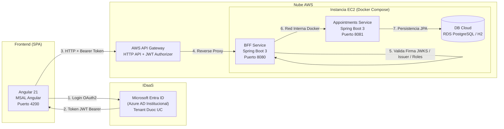

# 📘 DOCUMENTACIÓN TÉCNICA RESUMIDA - SISTEMA VIDASALUD
**Asignatura:** Desarrollo Cloud Native I (DSY1107) - Duoc UC  
**Evaluación:** Evaluación Parcial N° 1 (EP1)  
**Stack Tecnológico:** Angular 21 | Spring Boot 3 | Java 21/25 | Microsoft Entra ID | AWS (EC2 + API Gateway) | Docker  

---

## 1. 🎯 Visión General del Sistema

**VidaSalud** es una plataforma Cloud Native diseñada bajo una arquitectura orientada a microservicios desacoplados y seguridad basada en tokens (**Zero Trust**). Permite la gestión del ciclo de vida de atenciones médicas ambulatorias (solicitud, confirmación, sala de espera, atención y cierre), garantizando control de acceso basado en roles (**RBAC**) y validación criptográfica en múltiples capas perimetrales.

---

## 2. 🏛️ Arquitectura del Sistema en 1 Minuto



### Capas Principales:
1. **Capa Cliente (Frontend SPA):** Angular 21 Standalone con consumo reactivo y cliente MSAL oficial.
2. **Capa de Identidad (IDaaS):** Microsoft Entra ID (Azure AD) para autenticación federada institucional y emisión de JWT.
3. **Capa Perimetral (API Gateway):** AWS API Gateway como proxy de entrada con autorización JWT.
4. **Capa de Aplicación y Seguridad (BFF):** Spring Boot 3 como OAuth2 Resource Server que valida criptográficamente cada petición.
5. **Capa de Dominio y Datos:** Microservicio de atenciones médicas con máquina de estados y persistencia Spring Data JPA.

---

## 3. 🧩 Componentes Implementados

### 3.1 Frontend Angular (`frontend-vidasalud`)
- **Inicialización Segura de MSAL:** Ejecuta `msalInstance.initialize()` de forma asíncrona previo al bootstrap de Angular en `main.ts`, evitando *race conditions*.
- **Interceptor HTTP (`auth.interceptor.ts`):** Captura silenciosamente el token (`acquireTokenSilent`) con el scope `api://471213b2-94cc-4f45-bc30-d084984ac045/access_as_user` y lo inyecta en la cabecera `Authorization: Bearer <token>`.
- **Role Guard (`role.guard.ts`):** Protege rutas por roles (`Admin`, `Recepcionista`, `Paciente`). Si no cumple privilegios, redirige a la vista de error HTTP 403.
- **Vistas y Módulos:**
  - `Login`: Autenticación oficial con Entra ID + perfiles rápidos para evaluación docente.
  - `Appointments (Dashboard)`: KPIs interactivos en tiempo real, buscador por RUT y tabla reactiva con botones de acción según el estado actual.
  - `Modal Nueva Atención`: Creación validada con RUT, selección de servicio, box y fecha/hora.
  - `Catalog`: Vista protegida accesible únicamente por roles administrativos (`Admin` y `Recepcionista`).
  - `Unauthorized`: Pantalla amigable para el error HTTP 403 Forbidden.
  - `Navbar`: Barra superior con visualización del usuario activo, badge de rol y selector interactivo de perfiles para pruebas.

---

### 3.2 Microservicio BFF (`ms-vidasalud-bff`)
- **Tecnología:** Java, Spring Boot 3, Spring Security OAuth2 Resource Server.
- **Validación Criptográfica de Tokens:** Usa `NimbusJwtDecoder` para descargar y verificar las claves públicas (JWKS) de Microsoft Entra ID.
- **Validaciones Estrictas Implementadas:**
  - **Issuer (Emisor):** Soporta endpoints corporativos v1 (`sts.windows.net`) y v2 (`login.microsoftonline.com`) comprobando la pertenencia al Tenant institucional de Duoc UC.
  - **Audience (Audiencia):** Verifica que el claim `aud` corresponda al Client ID de la API protegida.
  - **Vigencia:** Comprueba automáticamente los timestamps `exp` (expiración) y `nbf` (no antes de).
- **Mapeo de Roles (RBAC):** Convierte el claim `roles` del JWT a autoridades `ROLE_Admin`, `ROLE_Recepcionista`, etc.
- **Códigos de Respuesta HTTP:**
  - `200 OK`: Petición válida y autorizada.
  - `401 Unauthorized`: Token ausente, firma inválida o token caducado.
  - `403 Forbidden`: Token auténtico pero rol insuficiente para el endpoint.
  - `200 OK en OPTIONS`: Soporte total para peticiones CORS pre-flight del navegador.
- **Pruebas de Integración:** 3 tests automatizados con `MockMvc` (`BffSecurityTests.java`) validando rechazo sin token, soporte CORS y endpoint de salud.

---

### 3.3 Microservicio de Atenciones (`ms-vidasalud-appointments`)
- **Tecnología:** Spring Boot 3, Spring Data JPA, H2 (dev) y PostgreSQL (prod).
- **Entidad de Dominio (`Appointment.java`):** Persistencia de ID, RUT del paciente, ID de servicio médico, ID de Box clínico, fecha de programación y estado de atención.
- **Máquina de Estados Estricta (`AppointmentStatus.java`):**
  $$\text{SOLICITADA} \longrightarrow \text{CONFIRMADA} \longrightarrow \text{EN\_ESPERA} \longrightarrow \text{EN\_ATENCION} \longrightarrow \text{CERRADA}$$
  *(Permite cancelación únicamente desde `SOLICITADA` y `CONFIRMADA`; los estados `CERRADA` y `CANCELADA` son terminales).*
- **Validación en Servicio:** Cualquier intento de saltar estados no permitidos arroja una excepción de negocio (`400 Bad Request`).
- **Pruebas Unitarias:** 5 pruebas en JUnit 5 (`AppointmentStatusTest.java`) certificando el 100% de los casos de transición válidos e inválidos.

---

### 3.4 Infraestructura y Despliegue Cloud (AWS)
- **Instancia EC2:** Ubuntu 24.04 LTS (`t2.micro`).
- **Configuración Swap (2GB):** Activación de memoria swap (`/swapfile`) para soportar la ejecución simultánea de 2 JVMs Spring Boot sin caídas por *Out-Of-Memory (OOM)*.
- **Orquestación con Docker Compose:** Archivo [`compose.yml`](file:///c:/dev/xd/cloudnative/compose.yml) configurando ambos servicios en red interna tipo *bridge*.
- **AWS API Gateway:** HTTP API con ruta `/api/{proxy+}` integrada hacia la IP pública de la EC2 (`:8080`) con autorizador JWT vinculado al OIDC de Microsoft Entra ID.
- **Higiene de Repositorio:** Archivos `.gitignore` configurados para evitar la subida de carpetas pesadas (`node_modules`, `target`, `.angular`) y claves privadas (`*.pem`, `*.key`, `.env`).

---

## 4. 📋 Matriz de Endpoints y Seguridad

| Endpoint | Método | Microservicio | Roles Permitidos | Respuesta Esperada |
| :--- | :---: | :---: | :---: | :--- |
| `/actuator/health` | `GET` | BFF | Público (Sin token) | `200 OK` (Estado UP) |
| `/api/appointments` | `GET` | BFF ➔ Appt | `Admin`, `Recepcionista`, `Paciente` | `200 OK` (Lista de citas) |
| `/api/appointments/{id}` | `GET` | BFF ➔ Appt | `Admin`, `Recepcionista`, `Paciente` | `200 OK` (Detalle de cita) |
| `/api/appointments` | `POST` | BFF ➔ Appt | `Admin`, `Recepcionista`, `Paciente` | `201 Created` (Cita con estado SOLICITADA) |
| `/api/appointments/{id}/status`| `PATCH` | BFF ➔ Appt | `Admin`, `Recepcionista` | `200 OK` (Si transición es válida) / `400 Bad Request` |
| `/api/catalog` | `GET` | BFF | `Admin`, `Recepcionista` | `200 OK` (Si rol permitido) / `403 Forbidden` (Si Paciente) |
| *Cualquier ruta sin token* | *Cualquiera*| BFF | Ninguno | `401 Unauthorized` |

---

## 5. 🚀 Guía Rápida de Ejecución Local

### Opción A: Con Docker Compose (Recomendado para Backend)
```bash
# En la raíz del proyecto:
docker compose up -d --build
```
- **BFF:** `http://localhost:8080`
- **Atenciones:** `http://localhost:8081`

### Opción B: Ejecución del Frontend Angular
```bash
cd frontend-vidasalud
npm install
npm start
```
- **Aplicación Web:** `http://localhost:4200`
- Incluye perfiles de evaluación rápida en la barra superior para probar instantáneamente los roles y validaciones.

---

## 6. 🔐 Datos de Configuración IDaaS (Microsoft Entra ID)

| Parámetro | Valor Configurado | Descripción |
| :--- | :--- | :--- |
| **Tenant ID** | `9333d7eb-2af5-4631-835e-78e32d2ae6d1` | Directorio institucional Duoc UC |
| **Client ID Frontend (SPA)** | `c6d8da59-5b41-4ce9-ac81-192a3dafc87e` | Aplicación registrada para Angular |
| **Client ID Backend (API)** | `471213b2-94cc-4f45-bc30-d084984ac045` | API protegida (Spring Boot BFF) |
| **Scope Requerido** | `api://471213b2-.../access_as_user` | Permiso delegado para llamadas HTTP |
| **Roles Soportados** | `Admin`, `Recepcionista`, `Paciente`, `Auditor` | App Roles configurados en el token |

---

## 7. 📁 Estructura Resumida del Proyecto

```
cloudnative/
├── frontend-vidasalud/           # SPA Angular 21 (MSAL, Guards, Interceptors, KPIs)
├── ms-vidasalud-bff/             # Backend For Frontend (Spring Boot 3, OAuth2 Resource Server)
├── ms-vidasalud-appointments/    # Microservicio de Dominio (Spring Boot 3, JPA, Máquina de Estados)
├── infra/                        # Configuración Docker Compose y variables .env.example
├── docs/screenshots/             # 6 Capturas de pantalla reales en alta resolución
├── DOCUMENTACION_SISTEMA.md      # Este documento (resumen ejecutivo de arquitectura y código)
└── README.md                     # Guía de inicio rápido del repositorio
```

---
*Documento elaborado para complementar la entrega técnica de la Evaluación Parcial N° 1 (DSY1107).*
