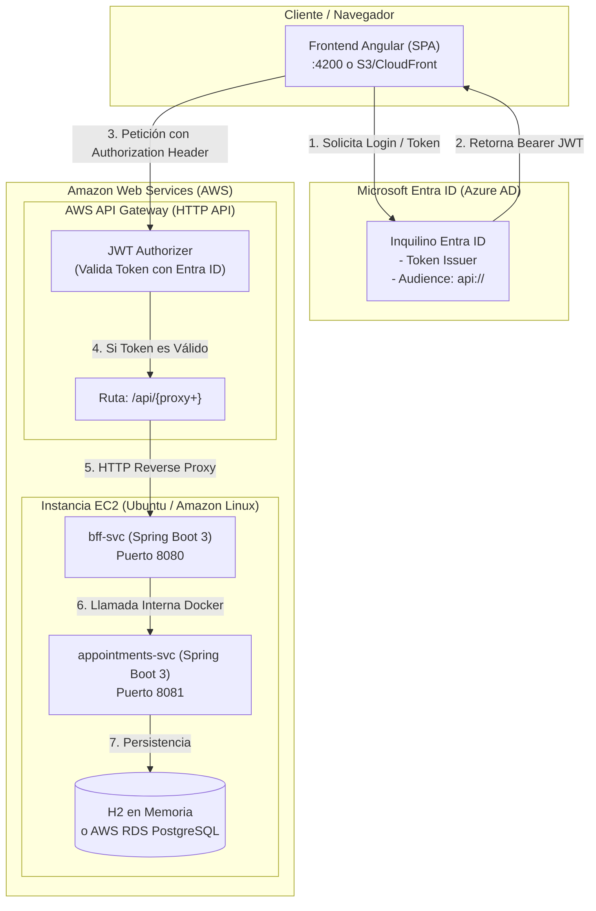

# ☁️ Guía Paso a Paso: Despliegue en AWS (EC2 + API Gateway + Microsoft Entra ID)
**Asignatura:** Desarrollo Cloud Native I (DSY1107)  
**Caso:** VidaSalud (Evaluación Parcial N°1)  

---

## 🏛️ 1. Arquitectura de Despliegue



---

## 🖥️ 2. Paso 1: Lanzar y Preparar la Instancia EC2

### 2.1 Especificaciones de la Instancia
1. En la consola de AWS, ir a **EC2** ➔ **Launch Instance**.
2. **Nombre**: `vidasalud-backend-ec2`.
3. **AMI**: `Ubuntu Server 24.04 LTS` (o `Amazon Linux 2023`).
4. **Tipo de Instancia**: `t2.micro` o `t3.micro` (Apta para Capa Gratuita / Free Tier).
5. **Key Pair**: Crear o seleccionar un par de claves `.pem` para conexión SSH.

### 2.2 Configuración del Security Group (Reglas de Entrada / Inbound Rules)
Configura las siguientes reglas en el grupo de seguridad de la EC2:

| Tipo | Puerto | Origen (Source) | Descripción |
| :--- | :--- | :--- | :--- |
| **SSH** | `22` | `Tu IP` o `0.0.0.0/0` | Acceso terminal remoto |
| **Custom TCP** | `8080` | `0.0.0.0/0` | Entrada del BFF (consumido por API Gateway) |
| **Custom TCP** | `4200` | `0.0.0.0/0` | *(Opcional)* Si levantas el Frontend Angular en la EC2 |
| **HTTP** | `80` | `0.0.0.0/0` | *(Opcional)* Si usas Nginx para el frontend |

---

### 2.3 Conexión y Configuración del Servidor

Conéctate por SSH desde tu terminal (PowerShell, Git Bash o CMD):
```bash
ssh -i "tu-clave.pem" ubuntu@<IP_PUBLICA_EC2>
```

#### A. Configurar Memoria Swap (CRÍTICO para t2.micro)
> [!IMPORTANT]
> Las instancias `t2.micro` cuentan únicamente con 1 GB de memoria RAM. Al ejecutar dos microservicios Spring Boot 3 con JVM, el sistema operativo activará el *OOM Killer* si no se cuenta con memoria de intercambio (*Swap*).

Ejecuta en la terminal de la EC2:
```bash
# 1. Crear archivo swap de 2GB
sudo fallocate -l 2G /swapfile

# 2. Asignar permisos seguros
sudo chmod 600 /swapfile

# 3. Formatear y activar swap
sudo mkswap /swapfile
sudo swapon /swapfile

# 4. Hacer permanente el swap tras reinicios
echo '/swapfile none swap sw 0 0' | sudo tee -a /etc/fstab

# 5. Verificar que swap esté activo (debe mostrar ~2GB en Swap)
free -h
```

#### B. Instalar Docker y Docker Compose
```bash
# Actualizar paquetes e instalar dependencias
sudo apt update && sudo apt install -y docker.io docker-compose-v2 git curl

# Habilitar Docker para el usuario sin sudo
sudo usermod -aG docker $USER
newgrp docker

# Verificar instalación
docker --version
docker compose version
```

---

## 🚀 3. Paso 2: Desplegar los Microservicios en EC2

### 3.1 Clonar el Código del Proyecto
```bash
git clone <URL_DE_TU_REPOSITORIO> cloudnative
cd cloudnative
```

### 3.2 Crear el Archivo de Variables de Entorno `.env`
Crea el archivo `.env` en la raíz del proyecto clonado:
```bash
nano .env
```
Pega la configuración con los IDs reales de Microsoft Entra ID de tu proyecto:
```env
# Configuración Microsoft Entra ID (Azure)
AZURE_TENANT_ID=9333d7eb-2af5-4631-835e-78e32d2ae6d1
AZURE_API_CLIENT_ID=471213b2-94cc-4f45-bc30-d084984ac045
SPA_CLIENT_ID=c6d8da59-5b41-4ce9-ac81-192a3dafc87e

# Base de Datos (Usa H2 en memoria por defecto)
DB_URL=jdbc:h2:mem:vidasalud_db;DB_CLOSE_DELAY=-1;DB_CLOSE_ON_EXIT=FALSE
DB_USER=sa
DB_PASS=
```
*(Guarda con `Ctrl + O`, presiona `Enter` y sal con `Ctrl + X`)*.

### 3.3 Construir y Levantar los Contenedores
```bash
docker compose up -d --build
```

### 3.4 Verificar el Estado del Despliegue
```bash
# Ver estado de los contenedores
docker compose ps

# Ver logs en tiempo real si requieres depurar
docker compose logs -f bff-svc

# Probar el endpoint de salud del BFF localmente en la EC2
curl http://localhost:8080/actuator/health
```
*Respuesta esperada:*
```json
{"status":"UP"}
```

---

## 🛡️ 4. Paso 3: Configurar AWS API Gateway (HTTP API + JWT Authorizer)

### 4.1 Crear la API
1. En la consola de AWS, busca **API Gateway**.
2. Presiona **Create API**.
3. En la tarjeta **HTTP API**, haz clic en **Build**.
4. **API name**: `vidasalud-api-gateway`.
5. Haz clic en **Review and Create** ➔ **Create**.

---

### 4.2 Crear la Ruta Proxy
1. En el panel izquierdo de tu API, selecciona **Routes**.
2. Haz clic en **Create**.
3. Configuración:
   * **Method**: `ANY`
   * **Path**: `/api/{proxy+}`
4. Presiona **Create**.

---

### 4.3 Configurar la Integración (Hacia la EC2)
1. Ve a **Integrations** en el menú lateral.
2. Selecciona la ruta `ANY /api/{proxy+}` y haz clic en **Attach integration** ➔ **Create integration**.
3. Configuración:
   * **Integration type**: `HTTP URI`.
   * **HTTP method**: `ANY`.
   * **URL**: `http://<IP_PUBLICA_EC2>:8080/api/{proxy}`
4. Presiona **Create**.

---

### 4.4 Configurar el JWT Authorizer (Microsoft Entra ID)
1. En el menú lateral de API Gateway, selecciona **Authorization**.
2. Ve a la pestaña **Manage authorizers** y haz clic en **Create authorizer**.
3. Completa los campos con los valores exactos de tu proyecto:
   * **Authorizer type**: `JWT`.
   * **Name**: `EntraID-Authorizer`.
   * **Identity source**: `$request.header.Authorization`.
   * **Issuer URL**:
     ```text
     https://login.microsoftonline.com/9333d7eb-2af5-4631-835e-78e32d2ae6d1/v2.0
     ```
   * **Audience (Audiencia)**:
     ```text
     api://471213b2-94cc-4f45-bc30-d084984ac045
     ```
4. Haz clic en **Create**.

---

### 4.5 Asociar el Authorizer a la Ruta
1. Vuelve a la pestaña **Routes** dentro de **Authorization**.
2. Selecciona la ruta `ANY /api/{proxy+}`.
3. En la sección **Attach an authorizer to this route**, selecciona `EntraID-Authorizer`.
4. Haz clic en **Attach authorizer**.

---

### 4.6 Obtener la URL Pública de API Gateway
1. En el menú lateral, haz clic en **Deployments** ➔ **Stages**.
2. Selecciona el stage `$default`.
3. Copia la **Invoke URL**. Tendrá un formato como:
   ```text
   https://abc123xyz.execute-api.us-east-1.amazonaws.com
   ```

---

## 🌐 5. Paso 4: Conectar el Frontend Angular con AWS

### 5.1 Actualizar la URL de API en el Frontend
En tu archivo de entorno del frontend (`frontend-vidasalud/src/environments/environment.ts` o `environment.development.ts`), reemplaza `apiUri`:

```typescript
export const environment = {
  production: false,
  msal: {
    clientId: 'c6d8da59-5b41-4ce9-ac81-192a3dafc87e',
    tenantId: '9333d7eb-2af5-4631-835e-78e32d2ae6d1',
    redirectUri: 'http://localhost:4200', // O URL pública de tu frontend en AWS
    apiUri: 'https://abc123xyz.execute-api.us-east-1.amazonaws.com', // <-- URL de API Gateway
    scope: 'api://471213b2-94cc-4f45-bc30-d084984ac045/access_as_user'
  }
};
```

### 5.2 Si Despliegas el Frontend en AWS (S3/CloudFront o EC2)
Si decides publicar la aplicación Angular en una IP o dominio público de AWS:
1. Ingresa a **Azure Portal** ➔ **Microsoft Entra ID**.
2. Ve a **App registrations** ➔ Selecciona `vidasalud-front` (SPA).
3. Entra en **Authentication**.
4. En la sección **Single-page application**, presiona **Add URI** y agrega la URL pública (ejemplo: `http://<IP_PUBLICA_EC2>:4200` o tu URL CloudFront).
5. Guarda los cambios.

---

## 🧪 6. Paso 5: Matriz de Evidencias de Prueba (Rúbrica EP1)

Para documentar tu entrega y validar que la pasarela de AWS y la seguridad funcionan correctamente, ejecuta las siguientes pruebas desde tu terminal:

### Caso 1: Petición sin Token (Validación del Authorizer de API Gateway)
```bash
curl -i https://<TU_API_GATEWAY_ID>.execute-api.us-east-1.amazonaws.com/api/appointments
```
* **Resultado Esperado:** `HTTP/2 401 Unauthorized`
* **Mensaje:** `{"message":"Unauthorized"}` *(Rechazado directamente por el JWT Authorizer de AWS antes de tocar la EC2)*.

---

### Caso 2: Petición con Token Válido de Microsoft Entra ID
```bash
curl -i -H "Authorization: Bearer <TU_JWT_TOKEN>" https://<TU_API_GATEWAY_ID>.execute-api.us-east-1.amazonaws.com/api/appointments
```
* **Resultado Esperado:** `HTTP/2 200 OK`
* **Cuerpo:** JSON con el listado de atenciones médicas.

---

### Caso 3: Control de Acceso Basado en Roles (RBAC 403 Forbidden)
Si un usuario con rol `Paciente` intenta acceder al catálogo administrativo:
```bash
curl -i -H "Authorization: Bearer <TOKEN_ROL_PACIENTE>" https://<TU_API_GATEWAY_ID>.execute-api.us-east-1.amazonaws.com/api/catalog
```
* **Resultado Esperado:** `HTTP 403 Forbidden` *(Validado por Spring Security en el BFF)*.

---

## 🔧 7. Solución de Problemas Frecuentes (Troubleshooting)

| Síntoma | Causa Probable | Solución |
| :--- | :--- | :--- |
| **Error 502 Bad Gateway en API Gateway** | La EC2 no está respondiendo en el puerto 8080 o el Security Group bloquea el tráfico. | 1. Verificar Security Group de EC2 (regla TCP 8080 abierta).<br>2. Ejecutar `docker compose ps` en EC2 para confirmar que `bff-svc` esté activo. |
| **Error 401 Unauthorized persistente** | La `Audience` o el `Issuer URL` en el JWT Authorizer no coinciden exactamente con los claims del token. | Verificar que el issuer termine en `/v2.0` y que la audience sea `api://<AZURE_API_CLIENT_ID>`. |
| **El contenedor se apaga solo (Killed)** | Memoria RAM agotada al iniciar Spring Boot en `t2.micro`. | Configurar los 2 GB de memoria Swap explicados en la sección 2.3. |
| **Error de CORS en el navegador** | API Gateway bloquea cabeceras entre el dominio del frontend y el gateway. | En la consola de API Gateway, ir a **CORS**, presionar **Configure**, agregar `*` a Access-Control-Allow-Origin y permitir cabeceras `Authorization,Content-Type`. |
