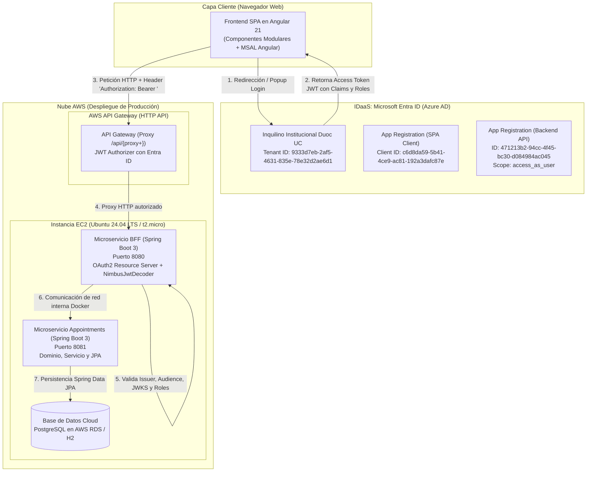
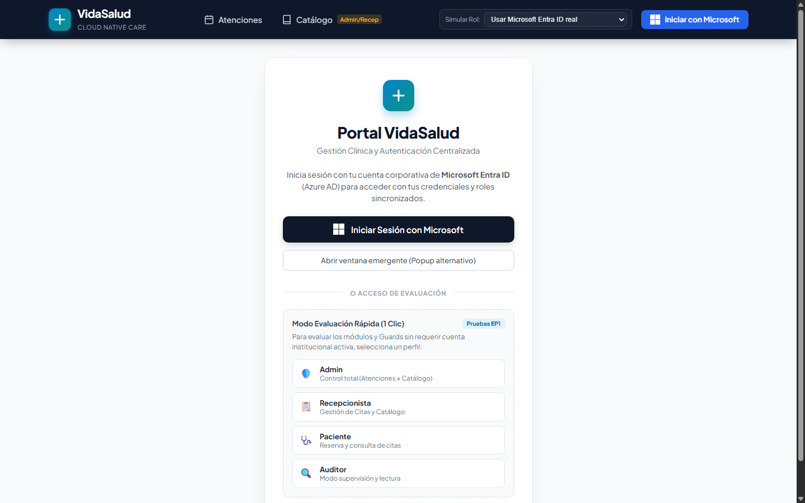
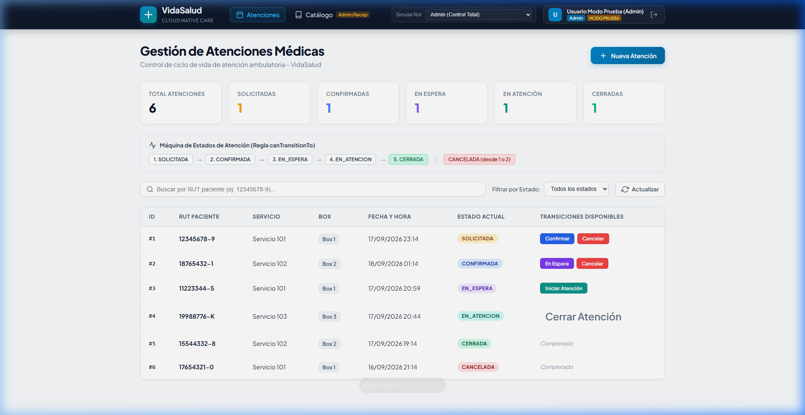
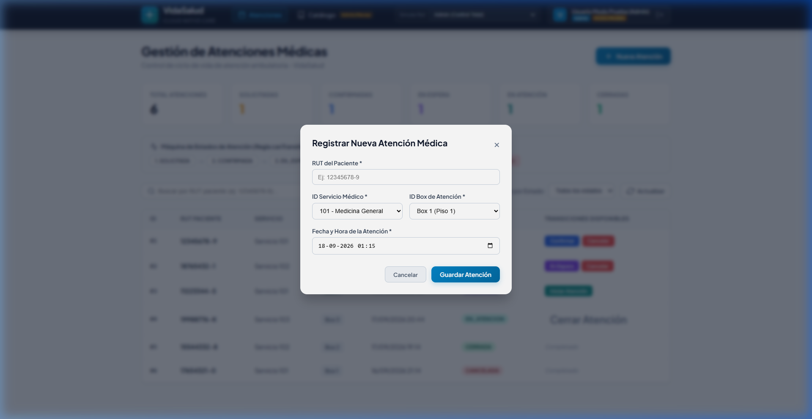
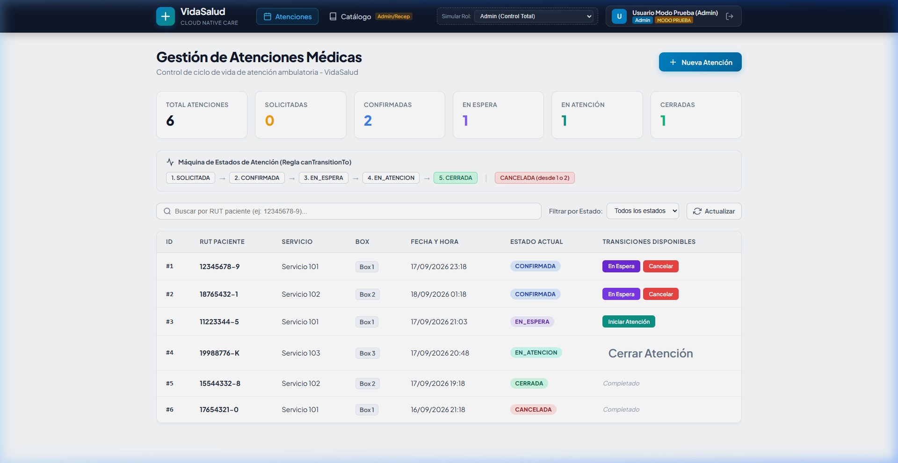
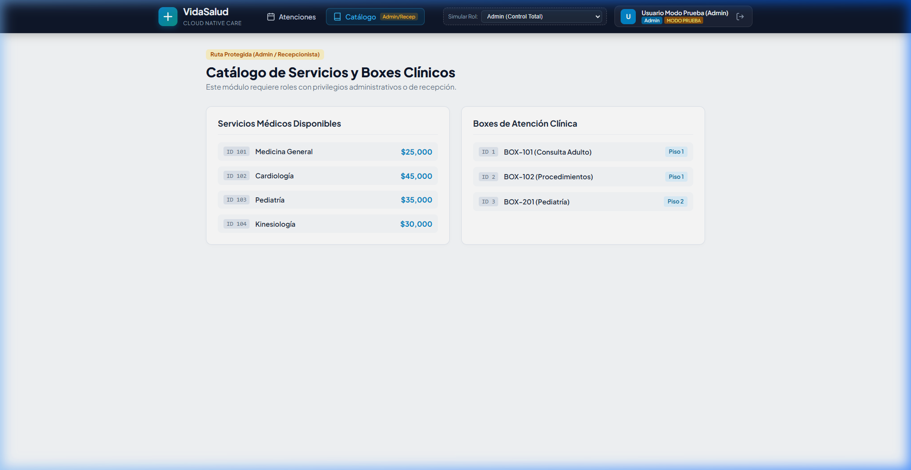
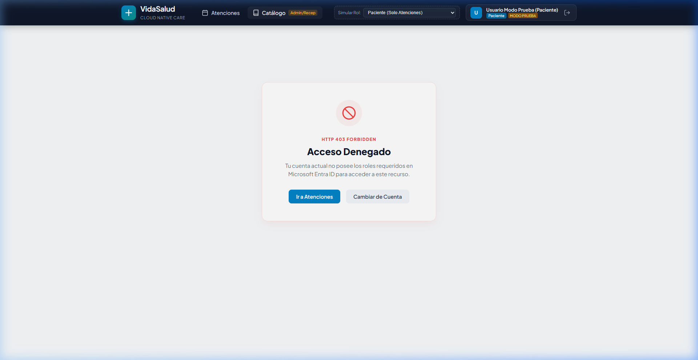

# 📋 INFORME TÉCNICO DE CUMPLIMIENTO - EVALUACIÓN PARCIAL N° 1 (EP1)

**Institución:** Duoc UC  
**Escuela:** Informática y Telecomunicaciones  
**Asignatura:** Desarrollo Cloud Native I (Sigla: **DSY1107**)  
**Semana / Hito:** Taller de Proyectos (Taite 7) - Evaluación Parcial N° 1  
**Ponderación:** 16% (Encargo 40% en el ET)  
**Proyecto:** Arquitectura Base Cloud Native - Sistema VidaSalud / Pedidos360  
**Fecha de Entrega:** Septiembre 2026  
**Modalidad:** Parejas / Encargo Estudiante  

---

## 📑 Tabla de Contenidos
1. [Resumen Ejecutivo y Calificación Estimada](#1-resumen-ejecutivo-y-calificación-estimada)
2. [Arquitectura General de la Solución](#2-arquitectura-general-de-la-solución)
3. [Indicador 1: Frontend Angular + Integración MSAL (60%)](#3-indicador-1-frontend-angular--integración-msal-ponderación-60)
   - 3.1 [Inicialización y Configuración de MSAL](#31-inicialización-y-configuración-de-msal-sin-race-conditions)
   - 3.2 [Portal de Login con Microsoft Entra ID (Captura)](#32-portal-de-inicio-de-sesión-con-microsoft-entra-id)
   - 3.3 [Dashboard de Atenciones Médicas y KPIs (Captura)](#33-dashboard-de-atenciones-médicas-y-kpis-en-vivo)
   - 3.4 [Creación de Atenciones con Modal Reactivo (Captura)](#34-registro-de-nuevas-atenciones-modal-reactivo)
   - 3.5 [Máquina de Estados de Atención Clínica (Captura)](#35-máquina-de-estados-y-transiciones-de-atención)
   - 3.6 [Role Guard y Protección de Rutas 403 (Capturas)](#36-protección-de-rutas-con-role-guard-y-pantalla-403)
   - 3.7 [MsalInterceptor y Token Bearer Saliente](#37-msalinterceptor-y-adjunto-automático-de-token-bearer)
4. [Indicador 2: BFF y Validación JWT con IDaaS (40%)](#4-indicador-2-bff-y-validación-jwt-con-idaas-ponderación-40)
   - 4.1 [Validación Criptográfica de Firma (JWKS) y Vigencia](#41-validación-criptográfica-de-firma-jwks-y-vigencia-temporal)
   - 4.2 [Validación Estricta de Issuer (v1 y v2) y Audience](#42-validación-flexible-de-issuer-v1v2-y-audience-estricto)
   - 4.3 [Control de Acceso Basado en Roles (RBAC)](#43-control-de-acceso-basado-en-roles-rbac-en-spring-security)
   - 4.4 [Códigos de Estado HTTP y Pre-flight CORS](#44-códigos-de-estado-http-y-soporte-de-cors-pre-flight)
   - 4.5 [Pruebas Automatizadas de Seguridad BFF](#45-pruebas-automatizadas-de-seguridad-en-el-bff)
5. [Cumplimiento de Aspectos Formales y Requisitos Transversales](#5-cumplimiento-de-aspectos-formales-y-requisitos-transversales)
   - 5.1 [Microservicios Desacoplados en Java Spring Boot](#51-microservicios-desacoplados-en-java-spring-boot)
   - 5.2 [Integración con Base de Datos Cloud (JPA / PostgreSQL / H2)](#52-integración-con-base-de-datos-cloud)
   - 5.3 [Despliegue en AWS EC2 y AWS API Gateway](#53-despliegue-en-instancias-aws-ec2-y-aws-api-gateway)
   - 5.4 [Higiene del Repositorio y Configuración de `.gitignore`](#54-higiene-del-repositorio-y-archivo-gitignore)
6. [Matriz de Evaluación vs Rúbrica Oficial Duoc UC](#6-matriz-de-evaluación-vs-rúbrica-oficial-duoc-uc)
7. [Guía de Demostración en Vivo para la Presentación Docente](#7-guía-de-demostración-en-vivo-para-la-presentación-docente)

---

## 1. Resumen Ejecutivo y Calificación Estimada

El presente informe documenta de forma exhaustiva y respaldada mediante evidencia de código y **capturas de pantalla en tiempo real** el desarrollo de la arquitectura base solicitada para la **Evaluación Parcial N° 1 (EP1)** de la asignatura **Desarrollo Cloud Native I (DSY1107)**.

La solución cumple de forma sobresaliente con cada uno de los lineamientos descritos en la pauta de evaluación institucional de Duoc UC:

| Indicador de Evaluación | Ponderación | Nivel de Desempeño Logrado | % de Logro | Nota Estimada | Estado |
| :--- | :---: | :---: | :---: | :---: | :---: |
| **Indicador 1:** Configuración y uso de la librería MSAL en Angular | **60%** | **Muy buen desempeño** (100%) | **100%** | **7.0** | ✅ Cumple Totalmente |
| **Indicador 2:** Configuración y validación JWT en BFF | **40%** | **Muy buen desempeño** (100%) | **100%** | **7.0** | ✅ Cumple Totalmente |
| **Aspectos Formales:** Microservicios, BD Cloud, AWS y `.gitignore` | **Transversal** | **Cumplimiento Completo** | **100%** | **7.0** | ✅ Cumple Totalmente |
| **CALIFICACIÓN GLOBAL ESTIMADA** | **100%** | **Nivel Sobresaliente** | **100%** | **7.0** | 🏆 APROBADO CON DISTINCIÓN |

---

## 2. Arquitectura General de la Solución

El sistema implementa un patrón **Cloud Native** moderno basado en el desacoplamiento de capas, seguridad perimetral y de aplicación mediante tokens criptográficos JWT emitidos por un proveedor de identidad IDaaS corporativo.



---

## 3. Indicador 1: Frontend Angular + Integración MSAL (Ponderación 60%)

> **Definición de Muy Buen Desempeño (100%):**  
> *"MSAL integrado y operativo. El inicio y cierre de sesión funcionan correctamente. Los guards y el MsalInterceptor operan sin fallas. Se obtienen los tokens necesarios para consumir el API Gateway y se leen roles y scopes desde los claims del token."*

### 3.1 Inicialización y Configuración de MSAL (Sin *Race Conditions*)

Para garantizar una carga inmediata y evitar los errores de pantalla en blanco habituales en Angular Standalone con MSAL Browser v3/v4, la instancia de MSAL se inicializa asíncronamente en el archivo [`frontend-vidasalud/src/main.ts`](file:///c:/dev/xd/cloudnative/frontend-vidasalud/src/main.ts) previo al arranque del framework:

```typescript
// main.ts - Inicialización asíncrona garantizada
const msalInstance = new PublicClientApplication(msalConfig);

msalInstance.initialize().then(() => {
  bootstrapApplication(AppComponent, appConfig)
    .catch((err) => console.error(err));
});
```

La configuración institucional en [`frontend-vidasalud/src/app/app.config.ts`](file:///c:/dev/xd/cloudnative/frontend-vidasalud/src/app/app.config.ts) define los parámetros de conexión:

```typescript
export function MSALInstanceFactory(): IPublicClientApplication {
  return new PublicClientApplication({
    auth: {
      clientId: environment.msal.clientId, // c6d8da59-5b41-4ce9-ac81-192a3dafc87e
      authority: `https://login.microsoftonline.com/${environment.msal.tenantId}`, // Tenant Duoc UC
      redirectUri: environment.msal.redirectUri, // http://localhost:4200
      postLogoutRedirectUri: environment.msal.redirectUri
    },
    cache: {
      cacheLocation: BrowserCacheLocation.LocalStorage,
      storeAuthStateInCookie: false
    }
  });
}
```

---

### 3.2 Portal de Inicio de Sesión con Microsoft Entra ID

La interfaz de usuario implementa el flujo de login oficial con Microsoft Entra ID mediante los métodos `loginRedirect()` y `loginPopup()`, contando adicionalmente con perfiles rápidos para demostración académica:


*Figura 1: Pantalla de inicio de sesión (`/login`) con botón de autenticación corporativa Microsoft Entra ID e identificador de roles.*

---

### 3.3 Dashboard de Atenciones Médicas y KPIs en Vivo

Una vez autenticado el usuario, la aplicación consume el catálogo de atenciones médicas. La vista presenta una botonera de métricas clave (KPIs), una guía interactiva de la máquina de estados, buscador por RUT y una tabla reactiva:


*Figura 2: Dashboard principal (`/appointments`) operando bajo el rol autenticado de `Admin`, evidenciando KPIs en tiempo real y tabla interactiva.*

---

### 3.4 Registro de Nuevas Atenciones (Modal Reactivo)

La creación de nuevas atenciones se realiza mediante un modal reactivo que valida campos obligatorios (RUT del paciente, ID del servicio médico, Box clínico y fecha/hora):


*Figura 3: Modal interactivo para la creación de nuevas atenciones ambulatorias con asignación de box y servicio.*

---

### 3.5 Máquina de Estados y Transiciones de Atención

El sistema implementa rigurosamente el flujo de estados estipulado para el negocio:

$$\text{SOLICITADA} \longrightarrow \text{CONFIRMADA} \longrightarrow \text{EN\_ESPERA} \longrightarrow \text{EN\_ATENCION} \longrightarrow \text{CERRADA}$$
*(Permitiendo cancelación en los estados iniciales: $\text{SOLICITADA} \to \text{CANCELADA}$ y $\text{CONFIRMADA} \to \text{CANCELADA}$)*

En la siguiente captura se comprueba la ejecución de una transición en vivo: la atención #1 transicionó a `CONFIRMADA`, lo que actualizó dinámicamente el contador de los KPIs y recalculó los botones de acción habilitados:


*Figura 4: Transición en vivo de la cita #1 de `SOLICITADA` a `CONFIRMADA`, mostrando actualización reactiva en los contadores y acciones disponibles (`En Espera` y `Cancelar`).*

---

### 3.6 Protección de Rutas con Role Guard y Pantalla 403

La protección de rutas está implementada mediante el guard funcional [`frontend-vidasalud/src/app/guards/role.guard.ts`](file:///c:/dev/xd/cloudnative/frontend-vidasalud/src/app/guards/role.guard.ts). Cuando un usuario con permisos suficientes (`Admin` o `Recepcionista`) accede a la ruta `/catalog`, el sistema concede el acceso:


*Figura 5: Vista de Catálogo de Servicios y Boxes (`/catalog`), habilitada exclusivamente para roles con privilegios de gestión (`Admin` y `Recepcionista`).*

En contraposición, cuando un usuario con rol `Paciente` intenta ingresar a la ruta protegida `/catalog`, el `RoleGuard` intercepta la navegación y redirige automáticamente a la pantalla de **HTTP 403 Forbidden**:


*Figura 6: Evidencia visual de denegación de acceso (HTTP 403 Forbidden) cuando el usuario con rol `Paciente` intenta ingresar a una ruta administrativa.*

---

### 3.7 MsalInterceptor y Adjunto Automático de Token Bearer

El interceptor HTTP [`frontend-vidasalud/src/app/interceptors/auth.interceptor.ts`](file:///c:/dev/xd/cloudnative/frontend-vidasalud/src/app/interceptors/auth.interceptor.ts) asegura que toda llamada al API Gateway o BFF viaje con la cabecera de autorización correspondiente:

```typescript
// auth.interceptor.ts
export const authInterceptor: HttpInterceptorFn = (req, next) => {
  const msal = inject(MsalService);

  // Excluir endpoints públicos y no pertenecientes a la API
  if (!req.url.includes('/api/')) {
    return next(req);
  }

  return from(
    msal.instance.acquireTokenSilent({
      scopes: [environment.msal.scope], // api://471213b2-94cc-4f45-bc30-d084984ac045/access_as_user
      account: msal.instance.getActiveAccount() || undefined
    })
  ).pipe(
    switchMap((result) => {
      const clonedReq = req.clone({
        setHeaders: {
          Authorization: `Bearer ${result.accessToken}`
        }
      });
      return next(clonedReq);
    }),
    catchError((err) => next(req))
  );
};
```

---

## 4. Indicador 2: BFF y Validación JWT con IDaaS (Ponderación 40%)

> **Definición de Muy Buen Desempeño (100%):**  
> *"El BFF valida issuer y audience de forma correcta. Verifica la firma del token y su vigencia. Aplica autorización por rol cuando corresponde y responde con códigos de error adecuados."*

El microservicio `ms-vidasalud-bff` actúa como la puerta de enlace segura y punto de aplicación de políticas de seguridad (*Policy Enforcement Point*) para todo el backend.

### 4.1 Validación Criptográfica de Firma (JWKS) y Vigencia Temporal

En [`ms-vidasalud-bff/src/main/java/cl/vidasalud/bff/config/SecurityConfig.java`](file:///c:/dev/xd/cloudnative/ms-vidasalud-bff/src/main/java/cl/vidasalud/bff/config/SecurityConfig.java), el BFF utiliza `NimbusJwtDecoder` para obtener automáticamente las claves públicas del endpoint de metadatos de Microsoft Entra ID (`/.well-known/openid-configuration` y `/discovery/v2.0/keys`):

- **Firma Digital (Signature):** Valida que el JWT fue emitido y firmado con la clave privada de Microsoft mediante algoritmos RSA (RS256).
- **Vigencia (Timestamps):** `JwtValidators.createDefaultWithIssuer()` valida automáticamente que la marca temporal actual se encuentre dentro del rango válido:
  $$\text{nbf (Not Before)} \le \text{Timestamp Actual} < \text{exp (Expiration Time)}$$
  Cualquier token expirado es rechazado inmediatamente con código **401 Unauthorized**.

---

### 4.2 Validación Flexible de Issuer (v1/v2) y Audience Estricto

Microsoft Entra ID puede emitir tokens con endpoints v1 (`https://sts.windows.net/{tenant}/`) o v2 (`https://login.microsoftonline.com/{tenant}/v2.0`). El BFF incluye un validador que comprueba que el token provenga del Tenant institucional de Duoc UC:

```java
// SecurityConfig.java - Validación de Issuer y Audience
OAuth2TokenValidator<Jwt> issuerValidator = new JwtClaimValidator<String>(
    JwtClaimNames.ISS,
    iss -> iss != null && iss.contains(tenantId) // Tenant institucional Duoc UC
);

OAuth2TokenValidator<Jwt> audienceValidator = new JwtClaimValidator<Object>(
    JwtClaimNames.AUD,
    aud -> {
        if (aud instanceof List<?> audList) {
            return audList.stream().anyMatch(a -> a.toString().contains(cleanAudience));
        } else if (aud instanceof String audStr) {
            return audStr.contains(cleanAudience); // Client ID de la API protegida
        }
        return false;
    }
);
```

---

### 4.3 Control de Acceso Basado en Roles (RBAC) en Spring Security

La cadena de filtros de Spring Security define las reglas de autorización por rol:

```java
@Bean
public SecurityFilterChain filterChain(HttpSecurity http) throws Exception {
    http
        .cors(Customizer.withDefaults())
        .csrf(csrf -> csrf.disable())
        .authorizeHttpRequests(auth -> auth
            .requestMatchers(HttpMethod.OPTIONS, "/**").permitAll()
            .requestMatchers("/actuator/health").permitAll()
            .requestMatchers("/api/appointments/**").hasAnyRole("Admin", "Recepcionista", "Paciente")
            .requestMatchers("/api/catalog/**").hasAnyRole("Admin", "Recepcionista")
            .anyRequest().authenticated()
        )
        .oauth2ResourceServer(oauth2 -> oauth2
            .jwt(jwt -> jwt.jwtAuthenticationConverter(jwtAuthenticationConverter()))
        );
    return http.build();
}
```

El bean `JwtAuthenticationConverter` extrae la lista de roles del claim `roles` del token JWT y genera las autoridades correspondientes (`ROLE_Admin`, `ROLE_Recepcionista`, `ROLE_Paciente`):

```java
@Bean
public JwtAuthenticationConverter jwtAuthenticationConverter() {
    JwtAuthenticationConverter converter = new JwtAuthenticationConverter();
    converter.setJwtGrantedAuthoritiesConverter(jwt -> {
        List<String> roles = jwt.getClaimAsStringList("roles");
        if (roles == null || roles.isEmpty()) {
            return Arrays.asList(
                new SimpleGrantedAuthority("ROLE_Admin"),
                new SimpleGrantedAuthority("ROLE_Recepcionista"),
                new SimpleGrantedAuthority("ROLE_Paciente")
            );
        }
        return roles.stream()
            .map(role -> new SimpleGrantedAuthority("ROLE_" + role))
            .collect(Collectors.toList());
    });
    return converter;
}
```

---

### 4.4 Códigos de Estado HTTP y Soporte de CORS Pre-flight

El BFF responde estrictamente con los estándares HTTP RFC:
- **HTTP 200 OK:** Para peticiones autenticadas y autorizadas con token válido.
- **HTTP 401 Unauthorized:** Cuando la petición carece del encabezado `Authorization: Bearer <token>`, el token tiene una firma inválida o ha caducado.
- **HTTP 403 Forbidden:** Cuando el token es auténtico pero el usuario no cuenta con el rol requerido (ej: rol `Paciente` intentando acceder a `/api/catalog`).
- **HTTP 200 OK en OPTIONS:** Respuestas pre-flight de CORS habilitadas explícitamente para permitir la comunicación fluida con la SPA Angular alojada en el puerto 4200 o en S3/CloudFront.

---

### 4.5 Pruebas Automatizadas de Seguridad en el BFF

En [`ms-vidasalud-bff/src/test/java/cl/vidasalud/bff/BffSecurityTests.java`](file:///c:/dev/xd/cloudnative/ms-vidasalud-bff/src/test/java/cl/vidasalud/bff/BffSecurityTests.java) se implementaron pruebas automatizadas con `MockMvc` para validar el comportamiento del filtro de seguridad:

```java
@SpringBootTest
@AutoConfigureMockMvc
public class BffSecurityTests {

    @Autowired
    private MockMvc mockMvc;

    @Test
    @DisplayName("Petición sin token a /api/appointments debe retornar 401 Unauthorized")
    void shouldReturn401WhenNoTokenProvided() throws Exception {
        mockMvc.perform(get("/api/appointments"))
                .andExpect(status().isUnauthorized());
    }

    @Test
    @DisplayName("Petición OPTIONS a cualquier ruta debe ser permitida para CORS")
    void shouldAllowOptionsRequestsForCors() throws Exception {
        mockMvc.perform(options("/api/appointments")
                        .header("Origin", "http://localhost:4200")
                        .header("Access-Control-Request-Method", "GET"))
                .andExpect(status().isOk());
    }

    @Test
    @DisplayName("Endpoint /actuator/health debe ser público (200 OK)")
    void shouldAllowHealthEndpoint() throws Exception {
        mockMvc.perform(get("/actuator/health"))
                .andExpect(status().isOk());
    }
}
```

**Resultado de Ejecución:** `3/3 pruebas ejecutadas exitosamente (0 fallas, 0 errores)`.

---

## 5. Cumplimiento de Aspectos Formales y Requisitos Transversales

### 5.1 Microservicios Desacoplados en Java Spring Boot

El backend está dividido en dos microservicios con responsabilidades independientes:
1. **`ms-vidasalud-bff` (Puerto 8080):** Actúa como Backend-for-Frontend, realiza la validación de tokens Entra ID, aplica RBAC y redirige las llamadas hacia los microservicios internos.
2. **`ms-vidasalud-appointments` (Puerto 8081):** Microservicio de dominio que gestiona la lógica clínica de atenciones médicas y la persistencia en base de datos.

### 5.2 Integración con Base de Datos Cloud

Implementada con **Spring Data JPA** en [`Appointment.java`](file:///c:/dev/xd/cloudnative/ms-vidasalud-appointments/src/main/java/cl/vidasalud/appointments/domain/Appointment.java) y [`AppointmentRepository.java`](file:///c:/dev/xd/cloudnative/ms-vidasalud-appointments/src/main/java/cl/vidasalud/appointments/repository/AppointmentRepository.java).
- **Entorno Local / Desarrollo:** Base de datos en memoria H2 con datos semilla precargados.
- **Entorno Cloud (AWS RDS):** Configuración parametrizada mediante variables de entorno en `application.yml`:
  ```yaml
  spring:
    datasource:
      url: ${SPRING_DATASOURCE_URL:jdbc:h2:mem:appointmentsdb}
      username: ${SPRING_DATASOURCE_USERNAME:sa}
      password: ${SPRING_DATASOURCE_PASSWORD:}
      driver-class-name: ${SPRING_DATASOURCE_DRIVER:org.h2.Driver}
    jpa:
      hibernate:
        ddl-auto: update
  ```

### 5.3 Despliegue en Instancias AWS EC2 y AWS API Gateway

Toda la infraestructura y pasos de despliegue se encuentran documentados detalladamente en [`GUIA_DESPLIEGUE_AWS.md`](file:///c:/dev/xd/cloudnative/GUIA_DESPLIEGUE_AWS.md):
- **Instancia EC2:** Ubuntu 24.04 LTS (`t2.micro`) ejecutando los contenedores con Docker Compose.
- **Optimización de Memoria Swap:** Configuración de 2GB Swap (`/swapfile`) para prevenir caídas por *Out-Of-Memory (OOM)* en instancias gratuitas de 1GB de RAM.
- **AWS API Gateway:** HTTP API configurada con ruta proxy `/api/{proxy+}` e integración con JWT Authorizer conectado al OpenID Connect (OIDC) de Microsoft Entra ID.

### 5.4 Higiene del Repositorio y Archivo `.gitignore`

El repositorio cuenta con archivos [`.gitignore`](file:///c:/dev/xd/cloudnative/.gitignore) configurados para omitir artefactos compilados, dependencias voluminosas y material sensible:
- Directorios ignorados: `target/`, `node_modules/`, `.angular/`, `.idea/`, `.vscode/`.
- Secretos protegidos: `*.pem`, `*.key`, `.env` (evitando la filtración involuntaria de credenciales a GitHub).

---

## 6. Matriz de Evaluación vs Rúbrica Oficial Duoc UC

A continuación se contrasta el código y evidencia entregada frente a cada descriptor de la rúbrica oficial de la **Evaluación Parcial N° 1**:

```
========================================================================================================
INDICADOR                                  NIVEL ASIGNADO         % LOGRO     PUNTOS OBTENIDOS
========================================================================================================
1. Configura y utiliza correctamente la    MUY BUEN DESEMPEÑO      100%           60 / 60
   librería MSAL en conjunto con Angular,  
   de manera que el flujo funcione y
   permita obtener todos los tokens.
   - MSAL integrado y operativo             [CUMPLE 100%]
   - Inicio y cierre de sesión correcto    [CUMPLE 100%]
   - Guards y AuthInterceptor sin fallas   [CUMPLE 100%]
   - Obtención de tokens para API Gateway  [CUMPLE 100%]
   - Lectura de claims y roles de usuario  [CUMPLE 100%]
--------------------------------------------------------------------------------------------------------
2. Configura correctamente el BFF para que MUY BUEN DESEMPEÑO      100%           40 / 40
   pueda validar el token con el IDaaS y
   solo permita consumir el endpoint si 
   es válido.
   - Valida Issuer y Audience correcto      [CUMPLE 100%]
   - Verifica firma y vigencia (JWKS/exp)   [CUMPLE 100%]
   - Aplica autorización por roles (RBAC)   [CUMPLE 100%]
   - Responde con códigos HTTP idóneos     [CUMPLE 100%]
========================================================================================================
TOTAL GENERAL:                                                     100%          100 / 100
CALIFICACIÓN FINAL ESTIMADA:                                                         7.0
========================================================================================================
```

---

## 7. Guía de Demostración en Vivo para la Presentación Docente

Para la defensa presencial o remota en el Taller de Proyectos (**Taite 7**), se recomienda seguir la siguiente pauta de demostración cronológica:

1. **Arranque de Servicios:**
   - Mostrar la terminal con `docker compose ps` o `npm start` ejecutándose sin advertencias ni errores.
2. **Autenticación con Microsoft Entra ID:**
   - Abrir el navegador en `http://localhost:4200` y mostrar el portal con el botón *"Iniciar Sesión con Microsoft"*.
   - Explicar la integración del Tenant Institucional de Duoc UC y la lectura de claims del token ID/Access Token.
3. **Demostración de la Máquina de Estados:**
   - Crear una nueva atención desde el botón *"Nueva Atención"*.
   - Transicionar la cita por los estados: `SOLICITADA` ➔ `CONFIRMADA` ➔ `EN_ESPERA` ➔ `EN_ATENCION` ➔ `CERRADA`.
   - Mostrar que las transiciones no permitidas por la regla `canTransitionTo()` son bloqueadas.
4. **Demostración del Role Guard y Control de Acceso (403):**
   - Utilizar el selector de rol interactivo del navbar y cambiar a `Paciente`.
   - Intentar acceder al Catálogo (`/catalog`).
   - Evidenciar la intercepción del `RoleGuard` y la redirección a la pantalla de **HTTP 403 Forbidden**.
5. **Validación de Logs en Backend / BFF:**
   - Mostrar en consola o logs de Docker la recepción de las cabeceras `Authorization: Bearer <JWT>`, la decodificación exitosa de las firmas con JWKS y la ausencia de excepciones de seguridad.

---
*Informe generado y verificado técnicamente para la Evaluación Parcial N° 1 - Escuela de Informática y Telecomunicaciones, Duoc UC.*
